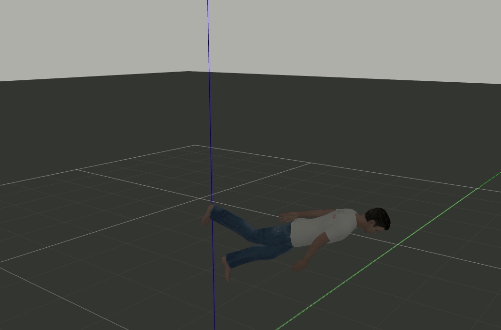

# Gazebo Operation Example

Operate the models in gazebo from python scripts.



## Usage

Using `catkin` tools to build this package.

Start Gazebo using roslaunch
```sh
roslaunch gazebo_ros empty_world.launch
```

Play the orientations which generated by a QDE(Quaternion Differential Equation)
```sh
rosrun gazebo_op play_orientation.py
```

## Dependencies
- `Gazebo`
- `gazebo_ros_pkgs`
- `Pandas`(optional)